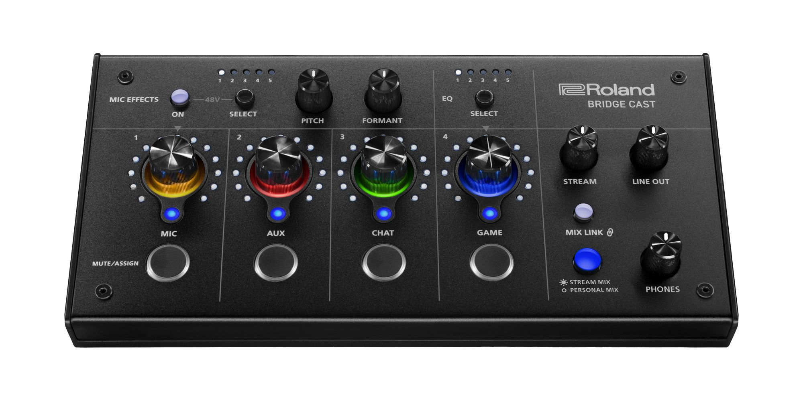

# รีวิว: Yamaha ZG01 เกมสตรีมมิ่งมิกเซอร์

 - เกริ่นนำ
 - การรับรู้ตำแหน่งของเสียง (sound localization)
 - Yamaha ZG01
 - ทดสอบการใช้งาน
 - จุดเด่น/จุดด้อย
 - โปรแกรม/อุปกรณ์เสริม
 - ตัวเลือกอื่น ๆ
 - ข้อมูลอ้างอิง
 
## เกริ่นนำ

หลายปีที่ผ่านมาผมมองหาอุปกรณ์ที่จะช่วยให้สัมผัสถึงประสบการณ์เสียงโอบล้อมแบบรอบทิศทางด้วยหูฟัง (3D immersive audio) เพื่อใช้ดูหนัง, ฟังเพลงและเล่นเกมส์ในตอนกลางคืน โดยไม่รบกวนคนรอบข้าง ไม่ว่าจะเป็น [หูฟังไร้สาย Yamaha YH-L700A](https://th.yamaha.com/th/products/audio_visual/headphones/yh-l700a/index.html), [หูฟังไร้สาย Sennheiser RS 175-U](https://th.sennheiser.com/products/rs-175-u), [หูฟังไร้สาย JVC XP-EXT1 EXOFIELD THEATER](https://www.us.jvc.com/headphones/microsite/exofield_ext1/) ที่ในคู่มือมีภาษาไทย แต่ไม่มีขายในไทย, การ์ดเสียง EPOS GSX 1000 1st/[2nd edition](https://www.eposaudio.com/en/th/gaming/products/gsx-1000-2nd-edition-gaming-amplifier-1001150), การ์ดเสียง Creative Sound Blaster [G6](https://us.creative.com/p/sound-blaster/sound-blasterx-g6)/[X4](https://us.creative.com/p/sound-blaster/sound-blaster-x4)/[GC7](https://us.creative.com/p/sound-blaster/sound-blaster-gc7) แต่ละตัวก็มีข้อดีต่างกันแต่ก็ยังไม่ตอบโจทย์ที่ผมต้องการ

ปลายปีที่แล้วได้รู้จักกับ [Yamaha ZG01](https://th.yamaha.com/th/products/proaudio/live_streaming_gaming/zg/zg01/index.html) ซึ่งเป็น Game Streaming Audio Mixer ตัวแรกจากทาง Yamaha ที่พัฒนามาตั้งแต่ปี [2020](https://www.yamaha.com/ja/recruitment/worth/zg01_project/) ที่เกิดจากการร่วมมือกันระหว่างทีมงาน Home Audio และทีมงาน Professional Audio ผสมผสานกับเทคโนโลยีต่าง ๆ ของ Yamaha จนออกมาเป็น ZG01 ที่เปิดตัวเมื่อ [20 เม.ย. 2565](https://th.yamaha.com/th/news_events/2022/0420_50_zg.html)

อ่านสเปคและรีวิวต่าง ๆ อยู่พักใหญ่ เห็นจุดเด่นของ ZG01 ที่ไม่เหมือนใครคือ HDMI In/Out รองรับเสียง 7.1 จาก Blu-ray player และเครื่องเกมคอนโซลโดยตรง พร้อมกับมีเทคโนโลยี [ViReal](https://www.yamaha.com/en/about/research/technologies/vireal/) ที่ช่วยจำลองระบบเสียงรอบทิศทางผ่านหูฟังทั่วไป สามารถทำงานได้โดยไม่จะเป็นต้องต่อคอมพิวเตอร์ และจุดด้อยที่เราสามารถแก้ไขได้ จึงตัดสินใจซื้อไปเมื่อปลายเดือน ม.ค. 2566 ที่ผ่านมา

## การรับรู้ตำแหน่งของเสียง (sound localization)

ระบบประสาทการมองเห็น (visual system) และ ระบบประสาทรับความรู้สึกทางกาย (somatosensory system) มีข้อมูลตำแหน่ง (spatial information) ต่างจากระบบการได้ยิน (auditory system) ที่ไม่มีข้อมูลส่วนนี้ ต้องใช้การดึงข้อมูลออกมาจาก เวลา (timing), ความดัง (intensity) และความถี่ (spectral) ของเสียงที่ได้ยิน
 
 การรับรู้ตำแหน่งของเสียง มีความสำคัญต่อ
  - การล่าเหยื่อ
  - การตรวจจับและหลีกเลี่ยงภัยคุกคาม
  - การรับฟังเสียงในพื้นที่เสียงดัง ([Cocktail party effect](https://themomentum.co/happy-health-the-cocktail-party-effect/))
  - การนำทางด้วยการใช้เทคนิคระบุตำแหน่งด้วยเสียงสะท้อน ([Echolocation](https://www.bbc.com/thai/features-43224386))

### ระบบพิกัด (coordinates)
 - ตำแหน่งในแนวราบ = azimuth
 - ตำแหน่งในแนวดิ่ง = elevation
 - ระยะทาง (distance)

### การรับรู้ตำแหน่งของเสียงในแนวราบ (Horizontal sound localization)
การรับรู้ตำแหน่งของเสียงในแนวราบ อาศัย binaural cues (binaural = หูสองข้าง)
 - Interaural Time Difference (ITD)
 - Interaural Level Differences (ILD)

#### Interaural Time Difference (ITD)
 - ความถี่เสียงต่ำกว่า 2 kHz
 - ITD เฉลี่ย 600 ns (nanoseconds)
 - สมองรับรูความแตกต่างในระดับ 10 ns ได้

#### Interaural Level Differences (ILD)
 - ความถี่เสียงสูงกว่า 2 kHz
 - ความดังของเสียงที่คนทั่วไปรับรู้ถึงความแตกต่างได้ ([Just-noticeable difference](https://en.wikipedia.org/wiki/Just-noticeable_difference#Music_production_applications)) อยู่ที่ 1 dB

#### การรับรู้ตำแหน่งของเสียงในแนวดิ่ง (Vertical sound localization)
การรับรู้ตำแหน่งของเสียงในแนวดิ่ง อาศัย monaural spectral cues (monaural = หูข้างเดียว)
 - Spectral Cues

### HRTF และประโยชน์ที่ได้รับ

Cognitive load

### Yamaha ViReal

[Development of shape-based average head-related transfer functions and their applications](https://www.jstage.jst.go.jp/article/ast/41/1/41_E19226/_pdf/-char/en)

รูปจาก [ヤマハ ViReal(バイリアル) \~積み重ねた要素技術でその空間をキャプチャーする\~](https://pro.miroc.co.jp/headline/yamaha-vireal/)

 - Monster Hunter World
   - [FAQ](https://www.capcom.co.jp/support/faq/full_platform_ps4_monsterhunter_world.html)
 - RESIDENT EVIL 7 biohazard
   - [RESIDENT EVIL 7 biohazard Wins Best VR Audio at 2018 G.A.N.G. Awards!](https://www.capcom.co.jp/ir/english/news/html/e180406.html)

## Yamaha ZG01

ZG01 ออกแบบมาให้ง่ายต่อการใช้งาน ลูกเล่นและช่องต่อจึงไม่ได้เยอะเหมือนมิกเซอร์ทั่วไป แต่ก็เพียงพอและครบถ้วนสำหรับการเล่นเกมและสตรีมมิ่ง

### สเปคเบื้องต้น

#### Input
 - Neutrik XLR combo พร้อมไฟเลี้ยง +48 V phantom power รองรับไมค์คอนเดนเซอร์
 - 3.5mm headset mic
 - 3.5mm 4-pole TRRS input/output สำหรับต่อสมาร์ทโฟนโดยเฉพาะ
 - HDMI x 2 ช่อง สำหรับเกมคอนโซล
 - USB type-C สำหรับ Steinberg virtual devices x 2 อุปกรณ์เสมือน (virtual devices) สำหรับ voice และ streaming

##### Output
 - 3.5mm headphone
 - 3.5mm 4-pole TRRS input/output สำหรับต่อสมาร์ทโฟนโดยเฉพาะ
 - 3.5mm speaker out
 - HDMI 2ch 24-bit/48kHz
 - USB type-C สำหรับ Steinberg virtual devices x 2 อุปกรณ์เสมือน (virtual devices) สำหรับ voice และ speaker

#### Power
 - ใช้ไฟจากช่อง USB type-C
 - ช่องต่อไฟแยก DC 5V 1.5A แบบ USB type-C ในกรณีที่ไม่ต่อกับคอมพิวเตอร์หรือต่อไฟเพิ่มหากไฟจาก USB ไม่พอต่อการใช้งาน

#### Volume
 - ลูกบิดปรับระดับเสียงดิจิตอลขนาดใหญ่แบบ velocity-sensitive หมุนเร็วระดับเสียงเพิ่มเร็ว-หมุนช้าระดับเสียงเพิ่มช้า พร้อมไฟ LED 25 ขีด รอบลูกบิด
   - ข้อมูลจากโปรแกรม [SoundVolumeView](https://www.nirsoft.net/utils/sound_volume_view.html)
     - **Min volume:** -96.00 dB
     - **Max volume:** 0.00 dB
     - **Volume step:** 1.50 dB/step
     - **Total steps:** 64 (96.00 หารด้วย 1.50)

#### อื่น ๆ
 - ไฟ LED ปรับความสว่างได้ (Low, High) โดยใช้[ฟิลม์สีฟ้าอ่อนแบบพิเศษ](https://www.yamaha.com/ja/recruitment/worth/zg01_project/)
 - Made in Malaysia

## ทดสอบการใช้งาน

## จุดเด่น/จุดด้อย

### จุดเด่น
 - ZG Sound Processing (ZG SURROUN D, FOCUS MODE, EQ, 3D CHAT SPACE) ในตัวเครื่อง ใช้งานได้โดยไม่ต้องเชื่อมต่อคอมพิวเตอร์
 - ViReal for Headphones ให้เสียงเซอร์ราวด์สามมิติด้วยการใช้งานหูฟังปกติ
 - HDMI IN/OUT รับ-ส่งสัญญาณเสียงแบบดิจิทัล รองรับระบบเสียง 7.1 แชนแนล
 - Loopback สัญญาณเสียงไปออกที่ HDMI และ USB ได้ ทำให้ยืดหยุ่นในการใช้งานสตรีมมิ่ง, ประชุมออนไลน์และฟังเพลงไปพร้อมกันได้ โดยอีกฝ่ายจะได้ยินแค่เสียงไมค์ของเรา
 - Aux ใช้งาน ZG01 เสมือนเป็น heatset ที่เสียบเข้ากับ smartphone, อัดเสียงสนทนาได้, เปิดเเสียง background เสมือนอยู่ที่ต่าง ๆ ได้

### จุดด้อย
 - Mic preamp ค่อนข้างน้อย +44 dB หากใช้ไมค์ที่มีความไวในการรับเสียงต่ำ ๆ เสียงที่ได้จะค่อนข้างเบา ต้องใช้ Mic Booster หรือปรับแต่งระดับเสียงใน post production แทน
 - การปรับแต่ง mixer พื้นฐาน ไม่ละเอียด
 - เสียงจาก voice changer ไม่ค่อยเป็นธรรมชาติ
 - ViReal for Headphones ไม่เหมาะกับเสียงที่ผ่านการปรุงแต่ง (baked) มาแล้ว เช่น binaural audio, ASMR เมื่อเปิดใช้งานเสียงเซอร์ราวด์สามมิติอาจไม่สามารถระบุทิศทางของแหล่งกำเนิดเสียงได้
 - ZG Controller ไม่มีคู่มือแบบละเอียดมาให้ด้วย ต้องค้นหาข้อมูลเพิ่มเติมจากเวปภาษาญี่ปุ่น

## โปรแกรม/อุปกรณ์เสริม

### โปรแกรมเสริม
 - [Youlean Loudness Meter](https://youlean.co/youlean-loudness-meter/)
 - [SoundVolumeView](https://www.nirsoft.net/utils/sound_volume_view.html)

### อุปกรณ์เสริม
 - Stand
   - [AC Acrylic Stand รุ่น U2](https://www.ac-acrylic.com/p/50/)
 - Microphone
   - [Audio-Technica AT2040 Hypercardioid Dynamic Podcast Microphone](https://www.audio-technica.com/en-us/at2040)
   - [Klark Teknik MIC BOOSTER CM-1](https://www.klarkteknik.com/product.html?modelCode=P0DPA)
   - [MOGAMI 2534 Neglex Quad Cable](https://www.kimlengaudio.com/mogami-2534-xm-xf.html)
   - [HOLZ WS01 Wind Shield](https://www.millionheadpro.com/product-detail.php?id=7883)
   - [VIJIM LS08 Flexible Overhead Camera Mount Desk Stand](https://www.ulanzi.com/products/vijim-ls08-flexible-arm-professional-live-streaming-stand-equipment)
 - Silicone port dust cover
 - HDMI splitter

## ตัวเลือกอื่น ๆ

### Roland BRIDGE CAST เปิดตัวต้นเดือนมกราคม 2566 ที่ผ่านมา มีจุดเด่นที่ 
 - Mic preamp สูงถึง +75 dB รองรับไมค์ที่มีความไวในการรับเสียงต่ำ เช่น Shure SM7B (-59 dB)

## ข้อมูลอ้างอิง
